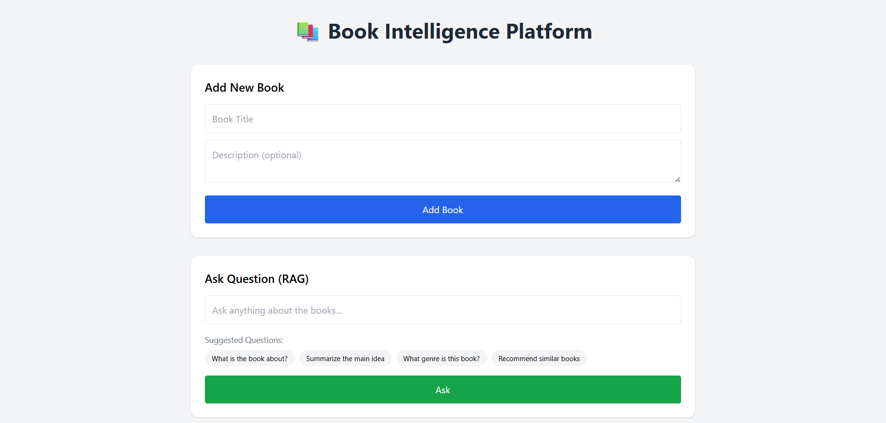
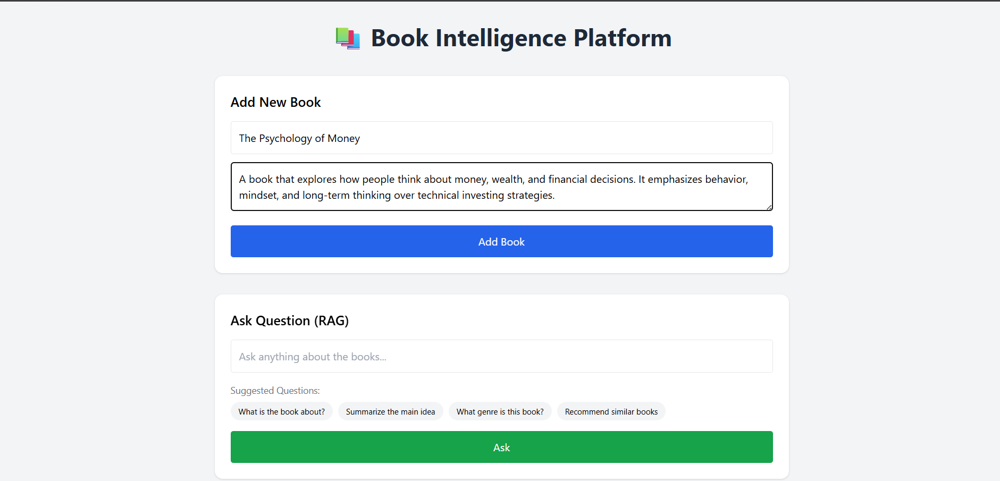
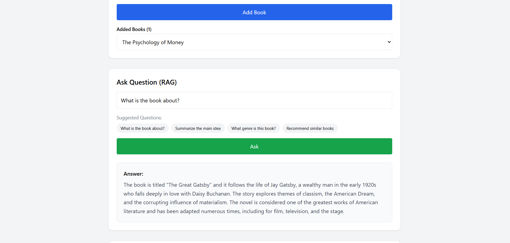
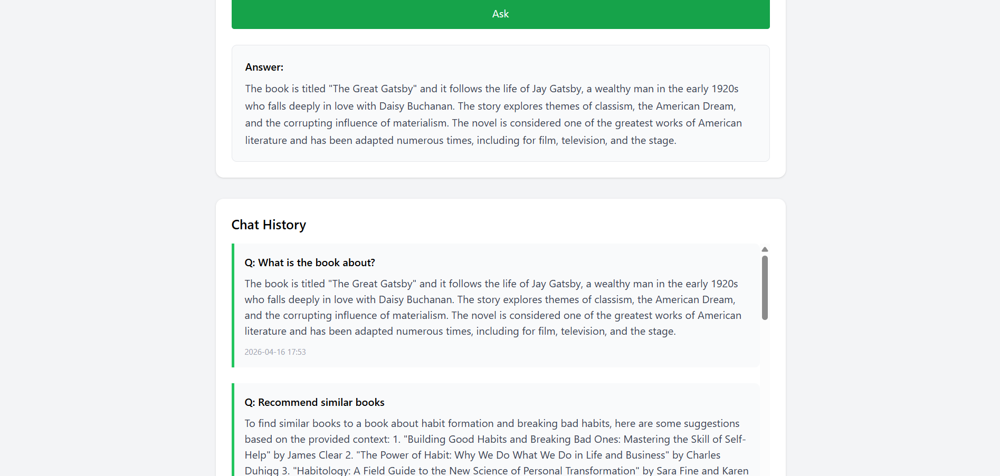
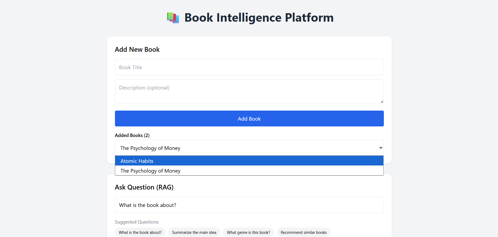

# AI-Book-Assistant
# Document Intelligence Platform - AI Book Assistant

**Full-Stack RAG Application with AI Insights & Intelligent Querying**

Early submission for Frontend/Backend Internship Assignment.

## ✨ Key Features Implemented

- ✅ Automated book scraping using **Selenium** (Multi-page support)
- ✅ AI Insight Generation (3 out of 4 required):
  - Summary generation
  - Genre classification
  - Recommendation logic ("If you like X, you’ll like Y")
- ✅ Complete **RAG Pipeline** (Embeddings + Vector Search + Contextual Answers with citations)
- ✅ Chat History saving
- ✅ Responsive and clean UI
- ✅ Caching of AI responses
- ✅ Embedding-based book recommendations

## Tech Stack

- **Backend**: Django REST Framework + Python
- **Vector Database**: ChromaDB
- **Embeddings**: Sentence-Transformers
- **LLM**: LM Studio (Local)
- **Frontend**: React + Tailwind CSS
- **Automation**: Selenium

## Screenshots

## Setup Instructions

### Backend
cd backend
.\venv\Scripts\Activate.ps1
pip install -r requirements.txt
python manage.py migrate
python manage.py runserver

### Frontend
cd frontend
npm install
npm run dev

### LM Studio (Required for AI)
Download and run LM Studio
Load any model (Llama 3.1 / Mistral recommended)
Start server on http://localhost:1234

## How to Use

Start both backend and frontend
Click "Add Book" (or use Scrape button in future version)
Go to Ask Question section and test RAG
Chat history will be saved automatically

## API Endpoints

*Method*  *Endpoinnt*          *Description*

GET     /api/books/         List all books

POST    /api/upload/        Add book + generate AI insights

POST    /api/ask/           RAG Question Answering

GET     /api/chat/history/  View chat history
